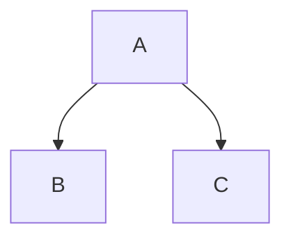

Learning Git and Github!
========================

Version control is an essential skill for developers to master, and Git is by far the most popular version control system on the web. In this fast-paced course, author Ray Villalobos shows you how to install Git and use the fundamental commands you need to work with Git projects: moving files, managing logs, and working with branches.

# What You'll Learn

> Plus, you'll [learn](https://www.twitter.com) how to work with the popular GitHub website to explore existing projects, clone them to your local hard drive, and use them as templates for your new projects.

# One

## Two

### Three

#### Four
Text
##### Five

###### Six
Text

Equal underneath for Headline level 1
=

Dash underneath for Headline level 2
-

Equal Dash
=-

Fourth Dash
=-=

**bold**
__bold__

*italic*
_italic_

~~strikethrough~~

> quote text
___
***
---

- Hyphen One
- Hyphen Two  

* Asterisk One
* Asterisk Two

+ Plus One
+ Plus Two

1. Number One
   * Unordered list one
     * Sub-indent one
     * Sub-indent two
   * Unordered list two
3. Number Two

This is a footnote[^1]. Another footnote[^2].

[^1]: My reference
[^2]: Another reference

https://www.linkedin.com

[Website](https://www.google.com "Google")

[YouTube]
[LinkedIn Learning][1]

[youtube]: https://www.youtube.com
[1]: https://www.linkedin.com/learning

This is an inline `print("Hello World)` code.

```py
# This is a code block.
name = "Grace"
print(name)
```

| Left  | Center | Right   |
| ----- | :-----:| ------: |
| One   | Four   | $1.00   |
| Two   | Five   | $2.00   |
| Three | Six    | $125.00 |

- [x] First
  - [x] One
  - [ ] Two
- [ ] Second

<details>
  <summary>collapsed text</summary>

  # Header

  This is the body for the collapsed text.
</details>

😁😈




![Avatrice]

[Avatrice]: https://pbs.twimg.com/media/GJH0VE9boAAEYN4?format=jpg&name=4096x4096

[](https://twitter.com/noooooo_te/status/1770464887720104137)
